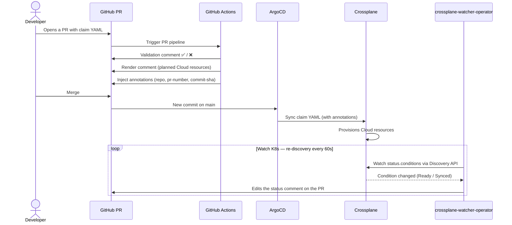
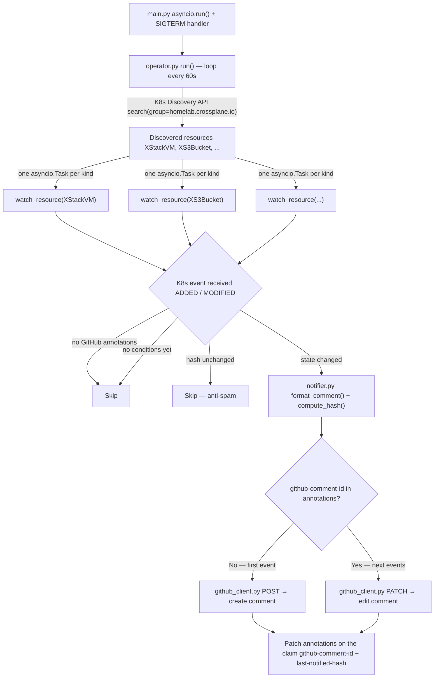
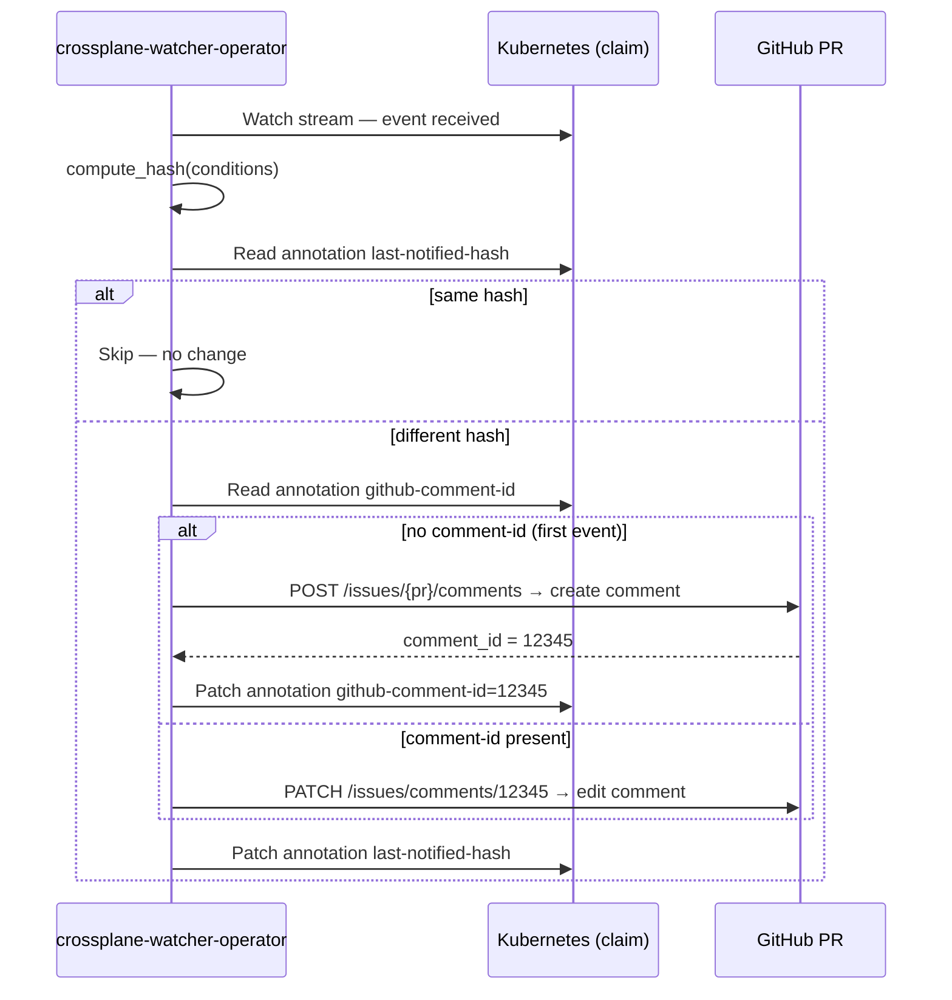
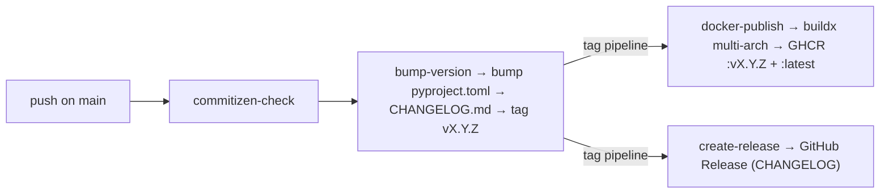
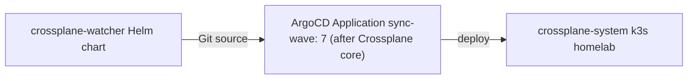

# crossplane-watcher-operator

[](https://python.org)
[](https://docs.astral.sh/uv/)
[](https://docs.astral.sh/ruff/)
[](https://github.com/features/actions)
[](https://crossplane.io)
[](https://commitizen-tools.github.io/commitizen/)
[](https://pre-commit.com/)

Kubernetes operator that watches Crossplane composites in the `homelab.crossplane.io` group and posts status updates as comments on the originating GitHub Pull Request.

## Why?

When a developer submits a claim through a GitOps PR, there is no feedback on what happens after the merge:

- Did the provisioning start?
- Is there a Crossplane error?
- Are my Cloud resources ready?

`crossplane-watcher-operator` closes this loop: **one single comment, edited in real time**, directly in the PR.

---

## Overview



---

## Internal architecture



---

## Notification strategy

Instead of creating a new comment on every state change (spam), the operator **always edits the same comment**:



### Comment format

```
## Crossplane Provisioning Status

**Resource:** `XStackVM/monapp-vm` (namespace: `dev-monapp`)
**Commit:** `abc123def`
**Updated at:** 2026-04-08T10:23:00Z

| Condition | Status | Reason | Message |
|---|---|---|---|
| ✅ Ready | True | Available | |
| ✅ Synced | True | ReconcileSuccess | |

<details><summary>Full status</summary> ... </details>
```

| Conditions | Emoji | Meaning |
|---|---|---|
| `Ready=True` | ✅ | Provisioning complete |
| `Ready=False` + `ReconcilePending` | ⏳ | Provisioning in progress |
| `Ready=False` + `ReconcileError` | ❌ | Error — see message |
| `Synced=False` | ⚠️ | Out of sync |

---

## CI/CD pipeline



---

## Configuration

Environment variables — prefix `CWO_` (Crossplane Watcher Operator).

| Variable | Required | Default | Description |
|---|---|---|---|
| `CWO_GITHUB_TOKEN` | ✅ | — | GitHub PAT with `public_repo` scope |
| `CWO_API_GROUP` | ❌ | `homelab.crossplane.io` | Kubernetes API group to watch |
| `CWO_LOG_LEVEL` | ❌ | `INFO` | Minimum log level (`DEBUG`, `INFO`, `WARNING`, `ERROR`) |
| `CWO_DISCOVERY_INTERVAL_SECONDS` | ❌ | `60` | Seconds between CRD re-discovery |
| `CWO_KUBE_CONTEXT` | ❌ | current-context | Kubernetes context (ignored in-cluster) |

---

## Local development

### Prerequisites

- Python 3.14
- [uv](https://docs.astral.sh/uv/)
- [Task](https://taskfile.dev)
- `kubectl` configured on a cluster with Crossplane

### Getting started

```bash
# Install dependencies
task install

# Install pre-commit hooks
task pre-commit:install

# Check the code
task lint
task fmt

# Run tests
task test:py
task test:helm

# Run the operator locally
export CWO_GITHUB_TOKEN=ghp_xxxx
task up
```

### Available tasks

| Command | Description |
|---|---|
| `task install` | Install dependencies with uv |
| `task lint` | Lint with ruff |
| `task fmt` | Format with ruff |
| `task fmt:check` | Check formatting without modifying |
| `task test:py` | Run pytest unit tests |
| `task test:helm` | Helm unit tests (helm-unittest) |
| `task test` | Run all tests |
| `task ci` | lint + fmt:check + tests (local pipeline) |
| `task docker:build` | Build Docker image locally |
| `task test:docker` | container-structure-test |
| `task up` | Run the operator locally |
| `task pre-commit:install` | Install git hooks |
| `task pre-commit:run` | Run all pre-commit hooks |

---

## Deployment

The operator is deployed via **ArgoCD** from `k3s-homelab` — same pattern as other platform components.



The Helm chart deploys:
- `Deployment` — the watcher pod
- `ServiceAccount` — Kubernetes identity for the pod
- `ClusterRole` — `get/list/watch/patch` on `homelab.crossplane.io/*`
- `ClusterRoleBinding`
- `Secret` — `CWO_GITHUB_TOKEN` (or use `existingSecret`)

The image is published to GHCR:
```
ghcr.io/cdelgehier/crossplane-watcher-operator:latest
```

---

## Claim annotations

**Read** (injected by `homelab-ci-templates`):

```yaml
metadata:
  annotations:
    homelab.io/github-repo: "cdelgehier/homelab-endusers"
    homelab.io/github-pr: "42"
    homelab.io/github-sha: "abc123def"
```

**Written** by the operator (state persisted without external storage):

```yaml
metadata:
  annotations:
    homelab.io/github-comment-id: "12345"       # ID of the GitHub comment to edit
    homelab.io/last-notified-hash: "a3f2b1c9"   # Hash of the last notified state
```
